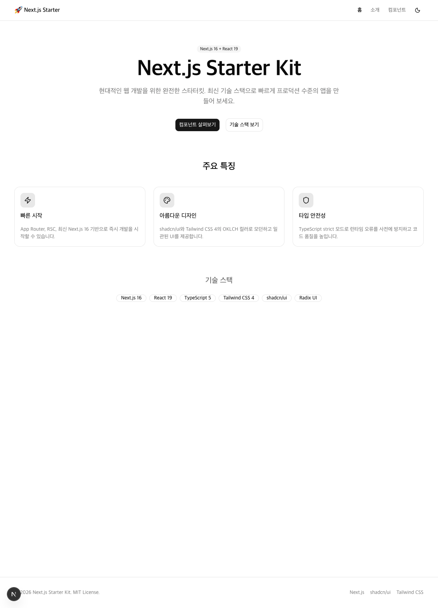
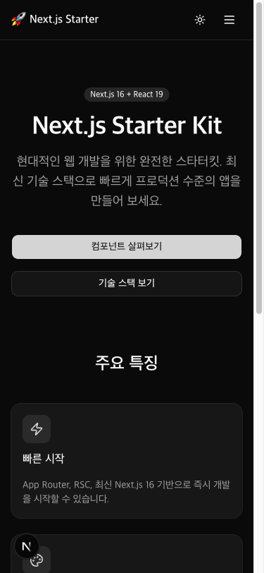
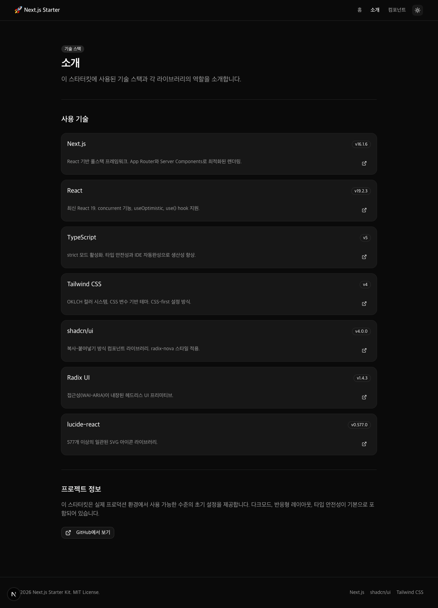

# Claude Next.js Starter

> Next.js + TypeScript + Tailwind CSS + shadcn/ui 기반 풀스택 스타터킷


---

## Features

- 🌙 **다크모드** — FOUC 없는 localStorage 기반 테마 전환
- 📱 **반응형 레이아웃** — 모바일 우선 설계, 햄버거 메뉴
- 🧩 **컴포넌트 쇼케이스** — 인터랙티브 데모 (카운터, 실시간 폼 미리보기, Toast)
- 🛡️ **타입 안전성** — TypeScript strict 모드

---

## Screenshots

<table>
  <tr>
    <td align="center"><b>홈 (라이트)</b></td>
    <td align="center"><b>홈 모바일 (다크)</b></td>
  </tr>
  <tr>
    <td></td>
    <td></td>
  </tr>
  <tr>
    <td align="center" colspan="2"><b>소개 페이지 (다크)</b></td>
  </tr>
  <tr>
    <td colspan="2" align="center"></td>
  </tr>
</table>

---

## 기술 스택

| 기술 | 버전 |
|------|------|
| Next.js | 16.1.6 |
| React | 19.2.3 |
| TypeScript | 5 |
| Tailwind CSS | 4 |
| shadcn/ui | 4.0.0 |
| lucide-react | 0.577.0 |

---

## 시작하기

```bash
npm install
npm run dev
```

브라우저에서 [http://localhost:3000](http://localhost:3000) 접속

---

## 프로젝트 구조

```
app/
  page.tsx              # 홈 (히어로 + 기능 카드)
  about/page.tsx        # 기술 스택 소개
  components/page.tsx   # 컴포넌트 쇼케이스 (탭 기반 인터랙티브 데모)
  layout.tsx            # 루트 레이아웃 (Navbar + Footer + FOUC 방지)
  globals.css           # Tailwind + OKLCH 테마 변수
components/
  layout/navbar.tsx     # sticky 헤더, 반응형
  layout/nav-links.tsx  # active 링크 (usePathname)
  layout/footer.tsx     # 푸터
  theme-toggle.tsx      # 다크/라이트 토글
  ui/                   # shadcn/ui 컴포넌트
lib/
  utils.ts              # cn() 유틸리티
```

---

## 페이지 안내

| 경로 | 설명 |
|------|------|
| 🏠 `/` | 홈 — 히어로, 주요 특징 카드, 기술 배지 |
| 📖 `/about` | 소개 — 기술 스택 상세 카드 |
| 🧩 `/components` | 쇼케이스 — Buttons / Forms / Feedback / Layout 탭 |

---

## 개발 명령어

```bash
npm run dev    # 개발 서버
npm run build  # 프로덕션 빌드
npm run lint   # ESLint 검사
```

---
